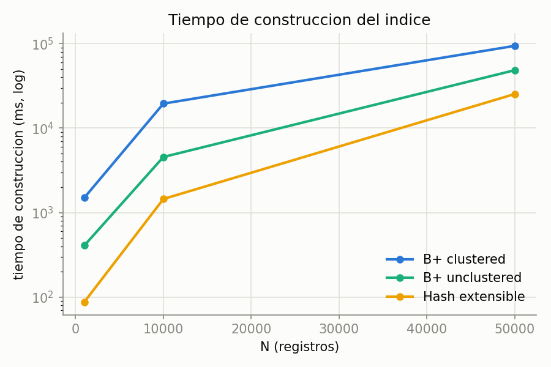
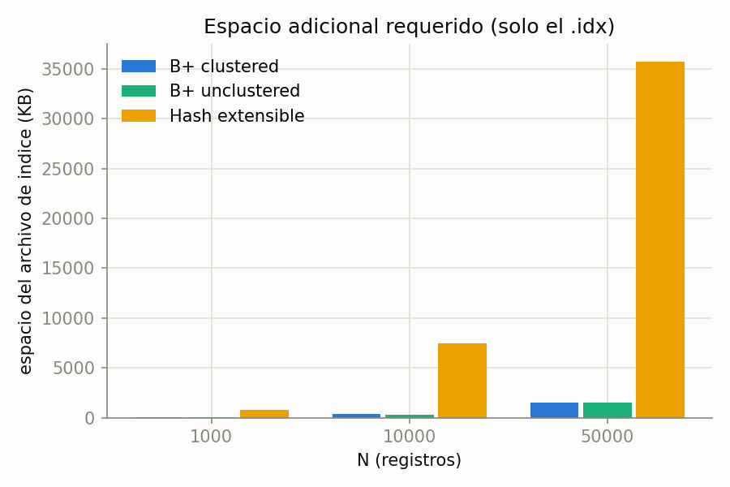
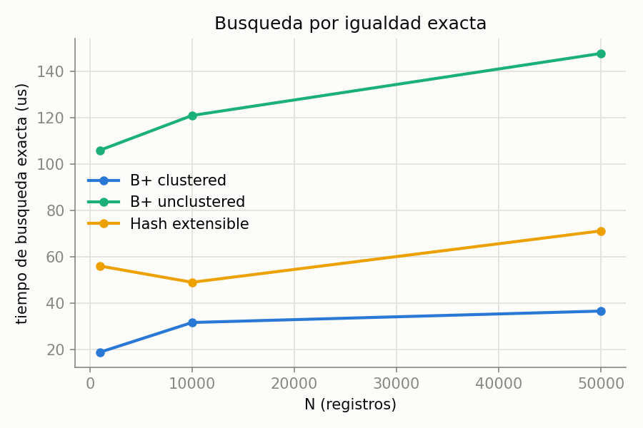
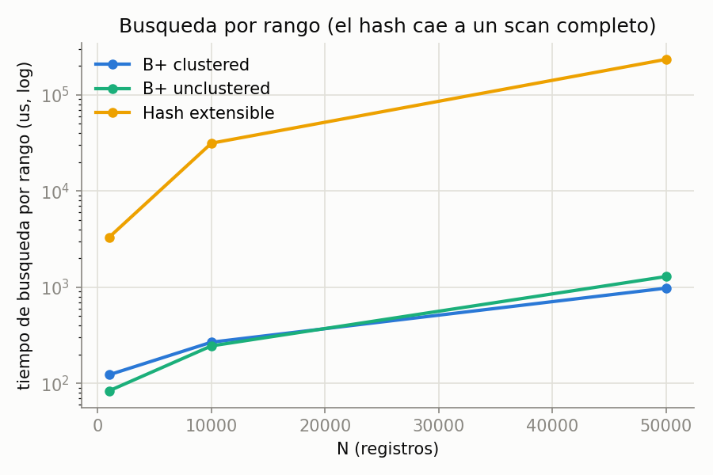
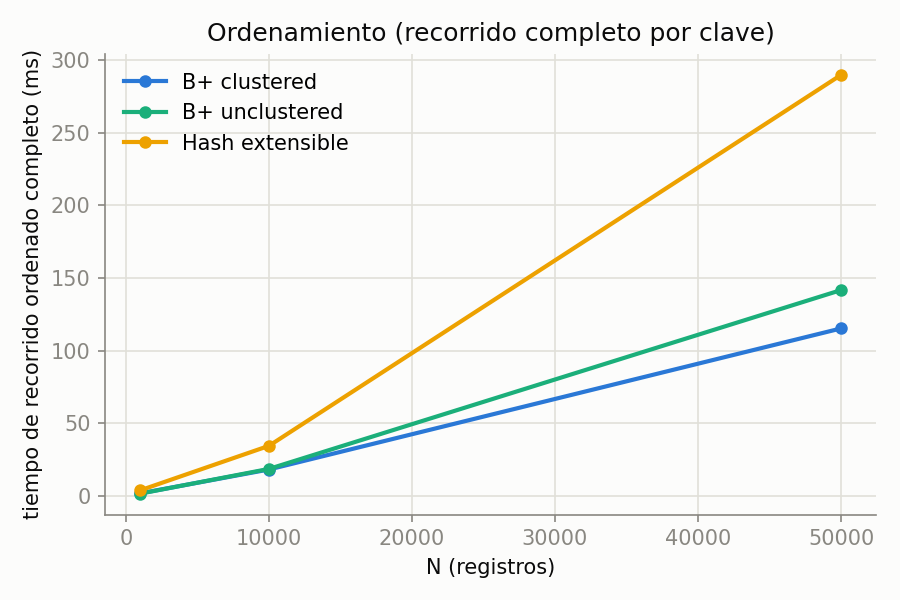
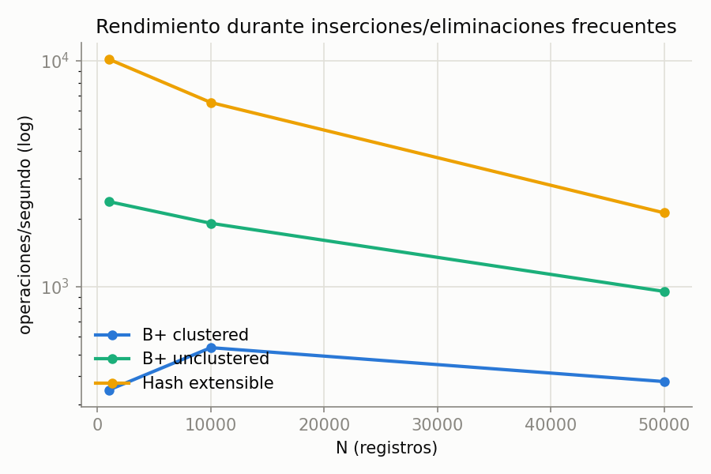
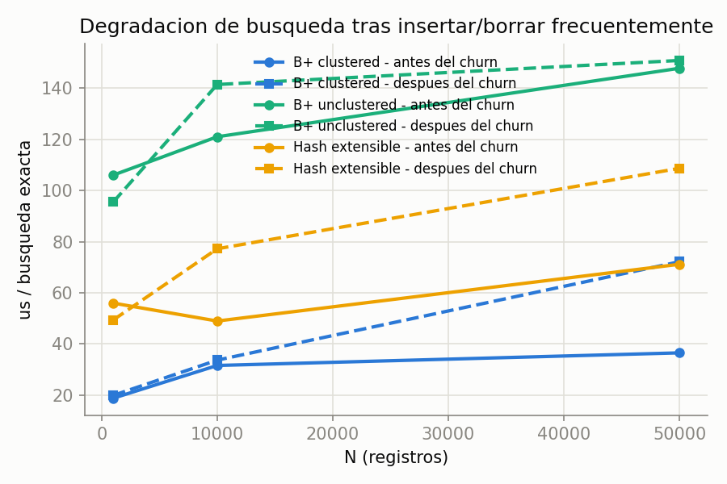

# Benchmark de estructuras de indexación

Compara **B+ agrupado (clustered)**, **B+ no agrupado (unclustered)** y **Hash
extensible**, en construcción, consultas (exacta / rango / orden), espacio
adicional y comportamiento bajo inserciones/eliminaciones frecuentes.

> Este documento cubre el deliverable de **Estructuras de Indexación**.

**Cómo reproducirlo** (desde la raíz del repo):

```bash
python -m benchmark.indices.index_benchmark          # tamaños por defecto: 1000, 10000, 50000
python -m benchmark.indices.index_benchmark 500 2000  # tamaños custom (corrida rapida)
python -m benchmark.indices.plot_index_benchmark      # regenera las graficas desde el JSON
```

Vive fuera de `tests/` a propósito: es un benchmark de rendimiento, no una
prueba de corrección, así que `run_all_tests.py` no lo corre solo — hay que
invocarlo a mano con los comandos de arriba.

Cada número es el promedio de 3 corridas (`REPEATS = 3` en el script), como
pide el enunciado.

## Resultados

### Construcción y espacio adicional

| índice          |      N | construcción (ms) | ms/insert | datos (KB) | índice (KB) |
| --------------- | -----: | -----------------: | --------: | ---------: | ----------: |
| B+ clustered    |  1,000 |            1,503.4 |     1.503 |       24.0 |        36.0 |
| B+ unclustered  |  1,000 |              408.7 |     0.409 |       32.0 |        36.0 |
| Hash extensible |  1,000 |               87.8 |     0.088 |       32.0 |   **752.0** |
| B+ clustered    | 10,000 |           19,500.7 |     1.950 |      172.0 |       372.0 |
| B+ unclustered  | 10,000 |            4,556.9 |     0.456 |      252.0 |       276.0 |
| Hash extensible | 10,000 |            1,451.4 |     0.145 |      252.0 | **7,456.0** |
| B+ clustered    | 50,000 |           94,118.9 |     1.882 |      840.0 |     1,552.0 |
| B+ unclustered  | 50,000 |           48,500.3 |     0.970 |    1,232.0 |     1,520.0 |
| Hash extensible | 50,000 |           25,328.3 |     0.507 |    1,232.0 | **35,712.0** |

> Números post-fix del `SequentialFile` (ver sección "Antes/después" más
> abajo) — el clustered pasó de ~O(N²) a O(N) real en construcción/inserción.
> Tamaños subidos de 500/2,000/5,000 a 1,000/10,000/50,000 una vez arreglado
> el O(N²): a esta escala se nota mucho mejor la curva logarítmica del B+
> frente al O(1) del hash (ver "Tiempo de consulta" abajo).




### Tiempo de consulta

| índice          |      N | µs/exacta |      µs/rango | ms/orden completo |
| --------------- | -----: | --------: | ------------: | -----------------: |
| B+ clustered    |  1,000 |      18.8 |         123.3 |               1.65 |
| B+ unclustered  |  1,000 |     106.0 |          84.0 |               1.44 |
| Hash extensible |  1,000 |      56.0 |   **3,312.2** |               3.72 |
| B+ clustered    | 10,000 |      31.6 |         268.9 |              18.07 |
| B+ unclustered  | 10,000 |     121.0 |         246.1 |              18.48 |
| Hash extensible | 10,000 |      49.0 |  **31,496.8** |              34.37 |
| B+ clustered    | 50,000 |      36.6 |         980.7 |             115.28 |
| B+ unclustered  | 50,000 |     147.7 |       1,294.6 |             141.71 |
| Hash extensible | 50,000 |      71.1 | **234,549.8** |             289.96 |

Punto clave: aunque el B+ crece con N (log N) y el hash en teoría se
mantiene O(1), a N=50,000 el hash (71.1µs) **sigue perdiendo** contra el
clustered (36.6µs) en búsqueda exacta — ver la explicación en "Tabla
resumen" y "Verificación de complejidad" más abajo (el hash tiene un costo
fijo de 5 páginas por operación; el B+ con este fanout no llega a
necesitar tantas ni siquiera a N=50,000).





### Rendimiento con inserciones/eliminaciones frecuentes (churn)

| índice          |      N | churn ops |  ops/seg | µs/exacta post-churn |
| --------------- | -----: | --------: | -------: | -------------------: |
| B+ clustered    |  1,000 |       200 |    347.8 |                 19.9 |
| B+ unclustered  |  1,000 |       200 |  2,376.9 |                 95.5 |
| Hash extensible |  1,000 |       200 | 10,162.0 |                 49.4 |
| B+ clustered    | 10,000 |     2,000 |    535.7 |                 33.7 |
| B+ unclustered  | 10,000 |     2,000 |  1,905.1 |                141.4 |
| Hash extensible | 10,000 |     2,000 |  6,533.1 |                 77.2 |
| B+ clustered    | 50,000 |     2,000 |    378.9 |                 72.1 |
| B+ unclustered  | 50,000 |     2,000 |    950.3 |                150.8 |
| Hash extensible | 50,000 |     2,000 |  2,118.2 |                108.6 |




## Tabla resumen: cuándo usar cada técnica

| Técnica             | Fuerte en                                                                                              | Débil en                                                                                                                                                                                        | Usar cuando...                                                                                                                                             |
| ------------------- | ------------------------------------------------------------------------------------------------------ | ----------------------------------------------------------------------------------------------------------------------------------------------------------------------------------------------- | ---------------------------------------------------------------------------------------------------------------------------------------------------------- |
| **B+ clustered**    | Rango y orden más baratos (los datos ya están físicamente ordenados); búsqueda exacta la más rápida de las tres incluso contra el hash a estos N (ver "Tiempo de consulta"); construcción O(N) tras el fix de `SequentialFile` (ver "Antes/después") | Sigue siendo el más caro en construcción/churn de los tres (aunque ya no cuadrático) — cada insert reordena físicamente el archivo | La tabla se lee mucho más de lo que se escribe, y las consultas son por rango/orden (ej. reportes, series de tiempo) sobre la clave primaria               |
| **B+ unclustered**  | Balance razonable en todo; no sufre el costo de reorganización del clustered; soporta rango y orden    | Búsqueda exacta la más lenta de las tres a estos tamaños (indirección extra hacia el heap: primero el índice, después el `HeapFile`)                                                                                                         | Índices secundarios sobre columnas que no son la clave física, o cuando hay muchas inserciones/eliminaciones y no se puede pagar el costo del clustered    |
| **Hash extensible** | Construcción e inserción individual más rápidas de las tres; buen throughput bajo churn                | **No soporta rango ni orden** — sin eso cae a un scan completo del heap (de ~56µs a ~234ms según crece N); espacio del índice mucho mayor (pre-asigna buckets por capacidad, no por uso real); búsqueda exacta pierde contra el B+ clustered incluso a N=50,000 (costo fijo de 5 páginas por operación, ver "Verificación de complejidad") | Solo hay búsquedas por igualdad exacta (ej. lookup de un ID único) y nunca se necesita `WHERE col BETWEEN`, `ORDER BY` esa columna, ni recorrerla en orden |

## Verificación de complejidad (páginas leídas por operación)

Además de los tiempos de arriba (que tienen ruido de disco/SO), hay tests
dedicados que cuentan **páginas físicas leídas por operación** — una medida
de complejidad que no depende de qué tan rápida esté la máquina:

- `tests/indexes/test_b_tree_complexity.py` — B+ (clustered/unclustered
  comparten la misma base): con N de 100 a 100,000 (1000x), páginas/search
  pasa de 1.00 a 3.00 — crecimiento logarítmico, como corresponde a un B+.
- `tests/indexes/test_hash_complexity.py` — Hash extensible: con el mismo
  rango de N, páginas/search se mantiene **fijo en 5** y páginas/delete en
  **3**, sin importar N. Confirma el O(1) esperado de un hash — el precio es
  el espacio (ver limitación #3 abajo): ~750-820 bytes/registro en disco,
  constante también, pero mucho más alto que los B+ porque pre-asigna
  buckets completos de 8KB por capacidad, no por uso real.

Ambos corren solos con `run_all_tests.py` (viven en `tests/`, a diferencia
del benchmark de arriba).

**Por qué el hash pierde en búsqueda exacta contra el B+ pese a ser O(1):**
las 5 páginas del hash son un costo *fijo*, no cero. El B+ con este fanout
(~8 hijos por nodo interno) necesita 1-3 páginas hasta N=100,000 — menos
que 5. El hash recién le ganaría al B+ cuando la altura del árbol supere
las 5 páginas, algo que con este fanout no pasa ni remotamente cerca de
los tamaños que se pueden probar en un benchmark razonable. Es un caso
real de "la constante importa más que el Big-O dentro del rango que
realmente se mide".

## Antes/después: el fix de `SequentialFile` (rama `seqfile-reorganize-fix`)

El punto #1 de limitaciones más abajo (el O(N²) del clustered) **ya se
arregló**, en una rama aparte para mantener este benchmark como referencia
del "antes". Medido con `SequentialFile` solo (sin el árbol B+ encima),
`ms/insert` promedio:

| N | antes (medido) | después (medido) |
| --: | --: | --: |
| 1,000 | 2.75 ms | 0.35 ms |
| 5,500 | 6.49 ms | 0.41 ms |
| 100,000 | horas (extrapolado del O(N²) medido) | 0.50 ms — **50 s totales** |

"Antes" a N=1,000/5,500 sube con N (2.75→6.49ms, más del doble); "después"
se mantiene prácticamente plano en el mismo rango (0.35→0.41ms) y sigue
plano hasta N=100,000 — O(N) real, no O(N²). El punto de 100,000 para
"antes" no se corrió literalmente (tomaría horas); es la extrapolación de
la curva cuadrática medida en los otros dos puntos, marcada como tal.

Con el índice clustered encima, esta es la comparación en los dos tamaños
donde sí se corrió el código viejo completo (antes de subir la escala del
benchmark oficial a 1,000/10,000/50,000):

| N | antes (medido) | después (medido) | mejora |
| --: | --: | --: | --: |
| 500 | 693.4 ms | 598.7 ms | 1.2x |
| 5,000 | 23,749.7 ms | 9,250.6 ms | 2.6x |
| 50,000 | ~40 min (extrapolado del O(N²) medido) | 94,118.9 ms (**1.6 min**, medido) | ~25x |

| | antes (N=5,000) | después (N=5,000) | mejora |
| --- | --: | --: | --: |
| throughput bajo churn (ops/seg) | 143.5 | 750.9 | 5.2x |

**Qué cambió, en dos partes:**

1. **`SequentialFile`** dejó de reorganizar cuando se llena una única página
   de overflow de tamaño fijo (disparo a intervalo constante → O(N²)) y pasó
   a reorganizar cuando el overflow supera un **% del archivo**
   (`OVERFLOW_RATIO = 0.3`, con un piso de 20 registros para no reorganizar
   archivos chiquitos) — mismo principio que ya usaba `WASTED_RATIO` para
   los deletes, ahora aplicado también a los inserts. Los reorganizes se
   espacian geométricamente en vez de a intervalo fijo (amortizado O(N)).
2. Eso solo no alcanzaba: dejar crecer el overflow hacía que
   `_find_neighbors` (llamado en cada insert) escaneara una cadena de
   overflow cada vez más grande, reintroduciendo el costo cuadrático por
   otra vía. Se reemplazó ese escaneo completo por un **recorrido local**
   de la cadena `next_rid` entre los dos vecinos de página principal más
   cercanos (ya ubicados con binary search) — solo atraviesa los registros
   de overflow que quedaron enganchados en ese tramo puntual, no el
   overflow completo.

`tests/files/test_sequential_file.py` (49 tests) sigue pasando completo.

## Antes/después: routing de duplicados en el B+ (rama `storage-fixes`)

El punto #2 de limitaciones más abajo **también se arregló**, en dos capas:

1. **Routing en `search()`/`range_search()`/`delete_ref()`:** se agregó
   `find_leftmost_child()` en `BTreeInternalPage` — una variante de
   `find_child()` que desempata a la **izquierda** en vez de a la derecha,
   para aterrizar en la *primera* hoja de un grupo de duplicados en vez de
   la última. `find_child()` no se tocó (`insert()` sigue necesitando
   desempatar a la derecha para ser consistente con `split()`).
2. **El bug real de fondo, más profundo de lo documentado originalmente:**
   al confirmar el fix de arriba con 3,000 duplicados, seguía fallando —
   `_find_key_index` (la que decide dónde insertar un separador nuevo
   cuando un split empuja una clave hacia el padre) desempataba al
   **revés** que `find_child_index`. Con muchos splits seguidos de la
   misma clave, cada separador nuevo se insertaba *antes* de los
   existentes en vez de después, dejando la lista de `children` del nodo
   padre en un orden corrupto (confirmado imprimiéndola:
   `[0, 31, 30, 29, ..., 3, 1, 32]` en vez de creciente). Ningún fix de
   routing podía arreglar la búsqueda mientras esto siguiera roto. Se
   corrigió `_find_key_index` para que desempate igual que
   `find_child_index`.

Verificado con 3,000 duplicados de una misma clave: `search()`,
`range_search()` y `delete_ref()` encuentran los 3,000 (antes: 97, luego
194, con cada capa del fix), y el recorrido global queda ordenado.
`_find_key_index` vive en `BTreeInternalPage`, compartida por clustered y
unclustered, así que el fix beneficia a ambos (sin cambiar nada para el
caso sin duplicados masivos, que es el que ya cubrían los tests).

## Limitaciones conocidas y mejoras planteadas

### 1. ~~`BPlusTreeClustered` escala ~O(N²) en construcción/inserción masiva~~ — RESUELTO

Ver la sección "Antes/después: el fix de `SequentialFile`" arriba.

### 2. ~~`BPlusTreeUnclustered`: routing incorrecto con muchos duplicados de la misma clave~~ — RESUELTO

Ver la sección "Antes/después: routing de duplicados en el B+" arriba.

### 3. Hash extensible: sin soporte de rango/orden (por diseño, no es un bug)

Una hash table no mantiene ningún orden entre claves, es esperable, no un
defecto de la implementación. `HashIndexAdapter` (en el benchmark) resuelve
`range_search`/orden con un scan completo del `HeapFile` subyacente porque
es la única forma correcta de responderlos sin un índice ordenado. El costo
medido (~56µs → ~234.5ms de N=1,000 a N=50,000) es el precio real de
intentar usar un hash para algo que no es su caso de uso.
