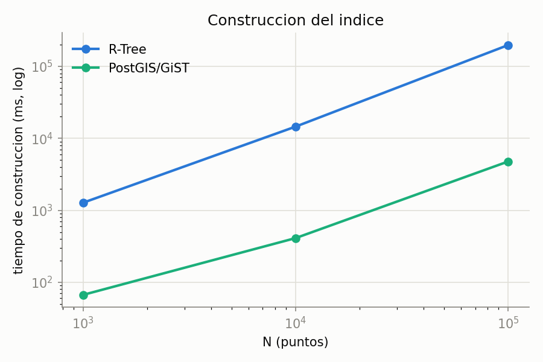
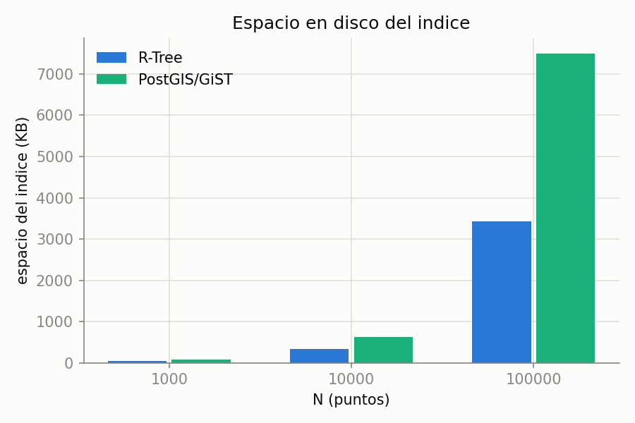
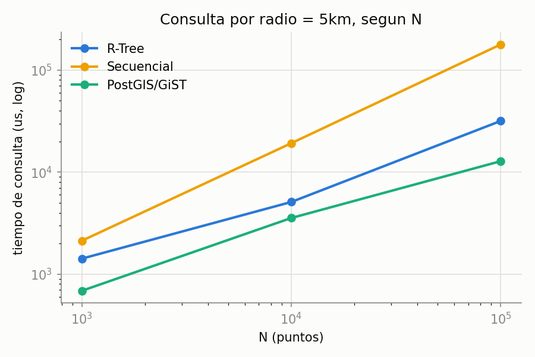
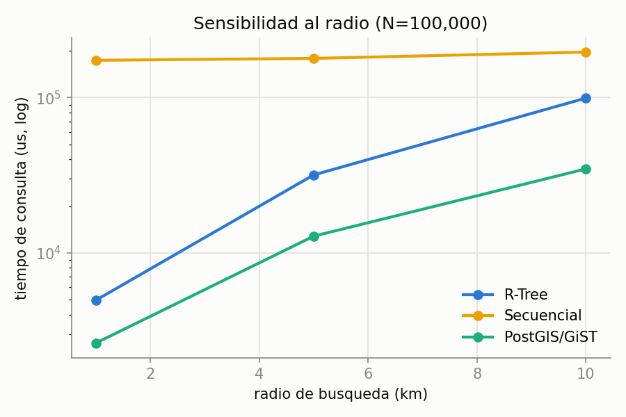
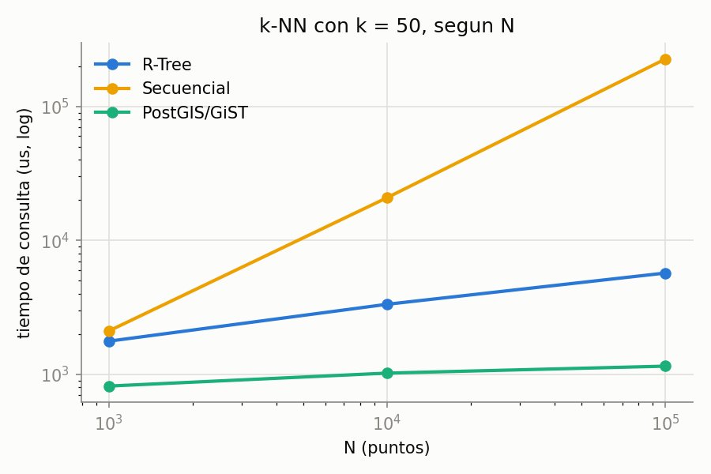
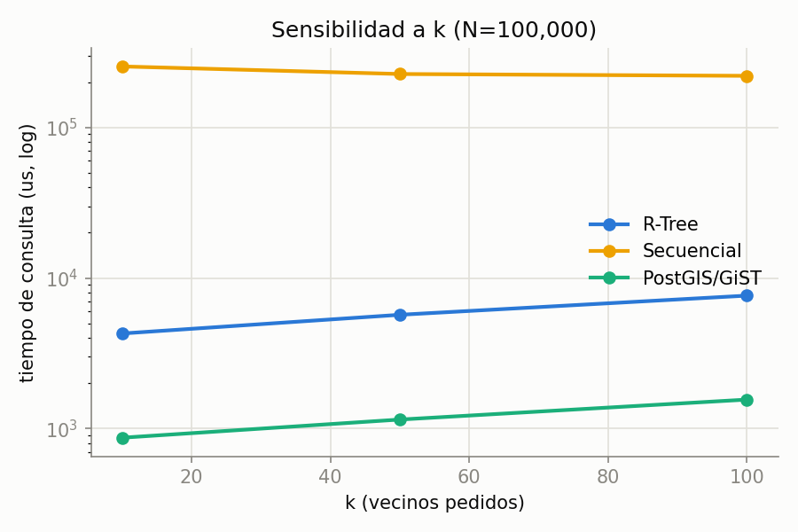

# Benchmark de índice espacial: R-Tree vs búsqueda secuencial vs PostGIS/GiST

Compara el **R-Tree** propio (`indexes/r_tree_base.py`), una **búsqueda
secuencial** (fuerza bruta sobre un arreglo de puntos) y **PostGIS/GiST**
(PostgreSQL 18 + PostGIS 3.6, local) en datos geográficos (lat/lon), con dos
tipos de consulta: **rango por radio** (en km) y **k-NN**.

**Cómo reproducirlo** (desde la raíz del repo):

```bash
PYTHONPATH=. python benchmark/spatial/rtree_benchmark.py          # R-Tree + secuencial, tamaños por defecto: 1000, 10000, 100000
PGPASSWORD=... python benchmark/spatial/postgis_benchmark.py       # PostGIS/GiST, requiere un Postgres local con PostGIS instalado
python benchmark/spatial/plot_rtree_benchmark.py                   # regenera las 6 graficas desde los JSON
```

`postgis_benchmark.py` crea su propia base (`chuta_spatial_bench`), una
tabla `points(id, geog geography(Point,4326))` y un índice
`USING GIST (geog)`; lee las credenciales de las variables de entorno
estándar de libpq (`PGHOST`/`PGPORT`/`PGUSER`/`PGPASSWORD`).

Vive fuera de `tests/` a propósito, igual que `benchmark/indices/`: es un
benchmark de rendimiento, no una prueba de corrección. La corrección del
R-Tree ya la valida `tests/indexes/test_r_tree_base.py`, comparando cada
resultado contra fuerza bruta antes de medir nada de tiempo.

Los puntos se generan al azar en una región de unos 55km × 55km (0.5° de
lado a baja latitud), lo bastante grande para que los radios de 1, 5 y
10km cubran selectividades bien distintas. Las tres técnicas usan la misma
región y la misma distribución uniforme (semillas distintas, no los mismos
puntos exactos entre R-Tree/secuencial y PostGIS, pero sí la misma
distribución).

## Resultados

**Cada número de las tablas de abajo es el promedio de 100 consultas**
(`REPEATS_QUERY = 100` en ambos scripts, `rtree_benchmark.py` y
`postgis_benchmark.py`).

### Construcción y espacio en disco

| técnica      |       N | construcción (ms) | espacio del índice (KB) |
| ------------ | ------: | ----------------: | ----------------------: |
| R-Tree       |   1,000 |           1,276.7 |                    36.0 |
| R-Tree       |  10,000 |          14,560.5 |                   340.0 |
| R-Tree       | 100,000 |         197,530.7 |                 3,436.0 |
| PostGIS/GiST |   1,000 |              67.0 |                    72.0 |
| PostGIS/GiST |  10,000 |             411.8 |                   632.0 |
| PostGIS/GiST | 100,000 |       **4,768.1** |                 7,496.0 |

La búsqueda secuencial no tiene fila equivalente: no mantiene ninguna
estructura propia más allá del arreglo de puntos, así que no hay nada que
"construir" ni espacio adicional que reportar, ese es justamente su
trade-off frente a las otras dos (ver tabla resumen).

PostGIS construye el índice entre **40 y 140 veces más rápido** que el
R-Tree propio (la brecha crece con N). Es el resultado esperado: el `GIST`
de Postgres es C compilado con décadas de optimización, y hace _bulk
insert_ de las filas antes de construir el índice completo, mientras que
el R-Tree de este repo inserta punto por punto con split incremental,
pagando E/S de página por cada inserción (ver `indexes/R_TREE_README.md`).
En espacio, sin embargo, el **índice del R-Tree pesa menos** a los tres
tamaños, cerca de la mitad que el de GiST: guarda solo
`(MBR, child_id)`/`(punto, RID)`, sin el overhead general de un índice de
un RDBMS completo (page headers, FSM, etc.).




### Consulta por radio (range query)

|       N | radio (km) | % del dataset | µs/R-Tree | µs/Secuencial |   µs/PostGIS |
| ------: | ---------: | ------------: | --------: | ------------: | -----------: |
|   1,000 |          1 |          0.09 |   1,156.5 |       2,226.6 |      1,012.2 |
|   1,000 |          5 |          2.31 |   1,419.1 |       2,126.5 |    **686.7** |
|   1,000 |         10 |          8.75 |   1,708.0 |       1,843.8 |  **1,053.1** |
|  10,000 |          1 |          0.10 |   2,341.0 |      21,380.3 |  **2,098.9** |
|  10,000 |          5 |          2.42 |   5,096.8 |      19,214.6 |  **3,550.6** |
|  10,000 |         10 |          8.68 |  10,504.3 |      20,334.7 |  **6,531.3** |
| 100,000 |          1 |          0.10 |   4,953.8 |     173,561.5 |  **2,624.4** |
| 100,000 |          5 |          2.34 |  31,739.6 |     178,603.2 | **12,801.1** |
| 100,000 |         10 |          8.56 |  99,117.9 |     196,084.3 | **34,703.2** |

Ambos índices (R-Tree y GiST) le ganan siempre a la secuencial, y la
ventaja de los dos crece con N. Entre los índices, **PostGIS gana en 8 de
los 9 casos** (pierde solo a N=1,000 con radio=1km, donde el overhead fijo
de ida y vuelta al servidor pesa más que la diferencia real de trabajo; el
R-Tree corre en el mismo proceso Python, sin red de por medio). A
N=100,000, PostGIS es entre 1.9 y 2.9 veces más rápido que el R-Tree
propio, según el radio.
El margen entre ambos índices se achica a medida que el radio crece (menos
selectivo = menos diferencia de poda), mismo patrón que ya se ve entre
R-Tree y secuencial.




### Consulta k-NN

|       N |   k | µs/R-Tree | µs/Secuencial |  µs/PostGIS |
| ------: | --: | --------: | ------------: | ----------: |
|   1,000 |  10 |   1,578.1 |       2,605.3 |   **544.5** |
|   1,000 |  50 |   1,767.0 |       2,106.4 |   **816.5** |
|   1,000 | 100 |   2,342.4 |       2,090.1 | **1,169.5** |
|  10,000 |  10 |   2,450.0 |      22,955.8 |   **624.2** |
|  10,000 |  50 |   3,332.9 |      20,844.2 | **1,020.1** |
|  10,000 | 100 |   5,082.7 |      24,292.7 | **1,378.6** |
| 100,000 |  10 |   4,284.7 |     253,840.1 |   **871.2** |
| 100,000 |  50 |   5,702.5 |     226,150.5 | **1,149.7** |
| 100,000 | 100 |   7,642.8 |     219,908.5 | **1,559.8** |

PostGIS gana los 9 casos de k-NN, y por mucho más margen que en rango: a
N=100,000 es entre **4.9 y 5 veces más rápido** que el R-Tree propio en
los tres valores de k. El operador `<->` de PostGIS (distancia usada directamente
por el GiST para orden de vecinos, sin heap intermedio en SQL) está más
optimizado que el best-first search con `heapq` en Python puro. El R-Tree
propio sigue ganándole siempre a la secuencial salvo la excepción ya
señalada a N=1,000/k=100 (ver nota abajo).




## Tabla resumen: cuándo usar cada técnica

| Técnica                 | Fuerte en                                                                                                                                                                                      | Débil en                                                                                                                                                                                                                                                         | Usar cuando...                                                                                                                                                  |
| ----------------------- | ---------------------------------------------------------------------------------------------------------------------------------------------------------------------------------------------- | ---------------------------------------------------------------------------------------------------------------------------------------------------------------------------------------------------------------------------------------------------------------- | --------------------------------------------------------------------------------------------------------------------------------------------------------------- |
| **R-Tree propio**       | Gana casi siempre a la secuencial en consultas selectivas; sin depender de un servidor externo, embebido en el proceso Python                                                                  | Construcción entre 40 y 140 veces más lenta que un motor de producción; pierde contra PostGIS en casi todos los casos medidos; único caso donde pierde incluso contra la secuencial: N chico (1,000) y k grande (100), donde el overhead de recorrer el árbol no se amortiza | Se necesita un índice espacial embebido, sin dependencias externas (ej. este mismo proyecto educativo), y el dataset no es trivialmente chico                   |
| **Búsqueda secuencial** | Cero costo de construcción y mantenimiento; simple; nunca degrada con inserciones ni borrados                                                                                                       | Pierde contra ambos índices en casi todos los casos medidos; el costo por consulta crece linealmente con N sin importar la selectividad                                                                                                                          | Datasets chicos, pocas consultas, o datos que cambian tanto que mantener un índice no se amortiza                                                               |
| **PostGIS / GiST**      | Más rápido que el R-Tree propio en construcción (entre 40 y 140 veces) y en casi toda consulta medida (k-NN: unas 5 veces; rango: hasta 2.9 veces); motor de producción maduro, con persistencia, concurrencia y transacciones | Mayor complejidad operativa (requiere un servidor Postgres corriendo, no es embebible); el índice en disco pesa cerca del doble que el del R-Tree propio a estos tamaños                                                                                                 | El caso de uso ya justifica tener un RDBMS completo detrás y no un índice embebido en la aplicación: en la práctica, casi siempre que la opción esté disponible |

## Limitaciones de este benchmark

- Los tiempos de PostGIS incluyen ida y vuelta por el socket local
  (`psycopg2` contra `localhost`), mientras que el R-Tree y la secuencial
  corren en el mismo proceso Python sin esa latencia. Es una diferencia
  estructural, propia de comparar un índice embebido contra un servidor
  cliente/servidor, no un artefacto de medición corregible.
- El R-Tree propio se mide con almacenamiento falso en memoria para el
  registro real (mismo patrón que `tests/indexes/test_r_tree_base.py`),
  así se aísla el costo del índice en sí del costo de un `HeapFile` real
  debajo. PostGIS, en cambio, sí persiste la fila completa en su tabla
  (columna `geog`), por eso también se reporta su tamaño de tabla por
  separado del índice en los resultados crudos (`resultados_postgis.json`).
- PostGIS mide distancia sobre `geography` (modelo elipsoidal, vía
  `ST_DWithin`/el operador `<->`); el R-Tree propio usa `haversine` sobre
  una esfera perfecta (ver `spatial/geometry.py`). La diferencia entre
  ambos modelos es de uso práctico despreciable (menos del 0.5%) a las
  distancias medidas acá, de 1 a 10km, y no afecta las conclusiones de
  rendimiento.
