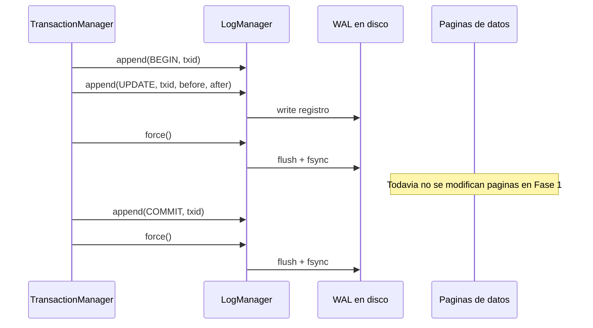

# Fase 1: diseño del log transaccional

## 1. Propósito

La Fase 1 define y construye el log que permitirá implementar atomicidad real en las fases posteriores. El objetivo no es todavía conectar el log con `Table` ni implementar `ROLLBACK`, sino dejar lista una pieza capaz de registrar modificaciones de forma durable y reproducible.

La idea central es **Write-Ahead Logging (WAL)**:

> Una modificación del log debe llegar a disco antes que la página de datos que describe.

Con esta regla, las fases siguientes podrán:

- deshacer modificaciones de una transacción abortada usando la imagen anterior;
- rehacer modificaciones confirmadas que todavía no llegaron a disco;
- identificar transacciones incompletas después de un crash;
- garantizar que `COMMIT` sea durable antes de liberar locks.

## 2. Contexto actual del repositorio

La base ya tiene implementada esta fase en:

- `storage/log_manager.py`: WAL binario append-only con LSN físico, CRC, lectura y protección entre hilos.
- `storage/file_manager.py`: `force()` mediante `flush()` y `os.fsync()`.
- `tests/table/test_log_manager.py`: pruebas aisladas del contrato.

Antes de esta implementación:

- `storage/transaction_manager.py` existe, pero está vacío;
- `FileManager.flush()` vacía el buffer de Python, pero no fuerza explícitamente la persistencia física con `fsync()`;
- `BufferManager` escribe páginas dirty mediante `FileManager.write_page()` y luego `flush()`;
- `HeapFile`, `SequentialFile`, índices y catálogo modifican páginas directamente;
- todavía no existe una abstracción de log ni un LSN asociado a una página.

Por ello, el log debe ser independiente del `BufferManager` y debe poder abrirse antes de que se carguen o modifiquen las tablas.

## 3. Alcance de esta fase

### Incluido

- Crear `storage/log_manager.py`.
- Definir un formato append-only para registros de log.
- Generar LSN monotónicos.
- Serializar y validar registros.
- Mantener `prev_lsn` por transacción.
- Implementar `append()`, `flush()` y `force()`.
- Añadir `fsync()` a `FileManager` o exponerlo mediante una operación equivalente.
- Leer el log completo hasta el último registro válido.
- Detectar registros truncados o corruptos sin interpretar todavía sus efectos.
- Probar el protocolo WAL de forma aislada.

### Fuera de alcance

- Aplicar undo o redo sobre tablas.
- Implementar `ROLLBACK` SQL.
- Liberar locks.
- Ejecutar recovery al arrancar.
- Crear checkpoints funcionales.
- Cambiar todavía `HeapFile`, `SequentialFile`, índices o catálogo.

Estas funciones pertenecen a las fases posteriores. La Fase 1 solo entrega el registro confiable de los cambios.

## 4. Decisiones de diseño

### 4.1 Un archivo de log por base

Usar un archivo fijo de la base, por ejemplo `chuta_wal.log`.

El archivo debe:

- abrirse en modo append o con escritura posicionada controlada;
- conservarse al cerrar correctamente el motor hasta que recovery/checkpoint pueda truncarlo de forma segura;
- no formar parte del catálogo de tablas;
- proteger sus operaciones concurrentes con un `threading.Lock`;
- ser durable mediante `flush()` seguido de `os.fsync()`.

Los locks de transacciones viven en memoria. El WAL sí permanece en disco.

### 4.2 LSN

Cada registro recibe un `lsn` monotónico. Para la primera versión, el LSN puede ser el offset del registro dentro del archivo o un contador persistido. Se recomienda usar el offset como identificador físico y guardar además un contador lógico si se necesita ordenar registros entre archivos.

El `LogManager` debe garantizar:

- ningún LSN repetido;
- orden de append bajo concurrencia;
- `prev_lsn` apuntando al registro anterior de la misma transacción;
- recuperación del siguiente LSN al reabrir el archivo.

### 4.3 Registros autocontenidos

Cada registro debe contener suficiente información para que una futura fase pueda aplicar undo y redo sin consultar el estado anterior de Python.

Tipos iniciales:

- `BEGIN`: inicia una transacción;
- `UPDATE`: representa cualquier cambio físico, incluyendo insert/delete en esta primera implementación;
- `COMMIT`: confirma la transacción;
- `ABORT`: indica que la transacción será revertida;
- `CLR`: compensates Log Record generado durante undo;
- `CHECKPOINT`: reservado para la fase de recovery.

Aunque el nombre sea `UPDATE`, se puede guardar un campo `operation` con valores `insert`, `delete`, `update`, `page_write`, `header_write` o `allocate_page`.

### 4.4 Imagen anterior y posterior

Para cada modificación física se guardan:

- `before`: bytes existentes antes de la modificación;
- `after`: bytes que tendrá el recurso después de la modificación.

Esto permite:

- redo: escribir `after`;
- undo: restaurar `before`.

El recurso modificado se identifica con:

- `file_name`;
- `resource_type`: `page`, `header`, `file_size` o `catalog_record`;
- `page_id` cuando corresponda;
- `offset` y `length` dentro del recurso;
- `page_lsn` anterior y nuevo, si la modificación es de una página.

Para una página completa, `offset=0` y `length=len(after)`. Para registros grandes, una fase posterior puede optimizar el formato usando fragmentos, pero la primera versión debe priorizar claridad.

## 5. Formato físico propuesto

Se recomienda un registro binario con esta estructura:

```text
+----------------+----------------------+----------------------+
| record_length  | record_header        | payload              |
| uint32         | campos fijos         | before/after/etc.    |
+----------------+----------------------+----------------------+
| crc32          |
+----------------+
```

El `record_length` incluye header, payload y checksum, pero no el propio campo de longitud. Así el lector puede saltar al siguiente registro sin conocer el tipo de operación.

### Cabecera lógica

| Campo | Tipo sugerido | Descripción |
|---|---|---|
| `lsn` | `uint64` | Identificador/posición del registro |
| `prev_lsn` | `uint64` | Registro anterior de la misma transacción; `0` si no existe |
| `transaction_id` | `uint64` | Identificador de la transacción |
| `record_type` | `uint8` | `BEGIN`, `UPDATE`, `COMMIT`, `ABORT`, `CLR`, `CHECKPOINT` |
| `operation` | `uint8` | Tipo de mutación física |
| `file_name_length` | `uint16` | Longitud del nombre del archivo |
| `resource_type` | `uint8` | Página, header, tamaño, etc. |
| `page_id` | `int64` | Página afectada; `-1` si no aplica |
| `offset` | `uint32` | Offset del cambio |
| `before_length` | `uint32` | Tamaño de la imagen anterior |
| `after_length` | `uint32` | Tamaño de la imagen posterior |
| `page_lsn` | `uint64` | LSN previo de la página, si aplica |

Después de la cabecera se almacenan el nombre del archivo, `before`, `after` y el `crc32`.

Todos los enteros deben tener endianness explícito, preferiblemente big-endian para mantener consistencia con las páginas existentes. No usar `pickle`: el formato debe ser inspeccionable, validable y estable.

## 6. API de `LogManager`

La API inicial puede ser:

```python
class LogManager:
    def __init__(self, path: str = "chuta_wal.log"):
        ...

    def append(self, record_type, transaction_id, *,
               prev_lsn=0, operation=None, file_name="",
               resource_type=None, page_id=-1, offset=0,
               before=b"", after=b"", page_lsn=0) -> int:
        ...

    def flush(self) -> None:
        ...

    def force(self) -> None:
        """flush + os.fsync del descriptor del log."""
        ...

    def read_all(self) -> LogScanResult:
        """Lee registros válidos y reporta una cola truncada."""
        ...

    def iter_records(self):
        ...

    def last_lsn(self) -> int:
        ...

    def close(self) -> None:
        ...
```

`append()` no debe prometer durabilidad por sí solo. La política debe ser explícita:

- `append()` agrega el registro al buffer/archivo;
- `flush()` pasa los bytes al sistema operativo;
- `force()` ejecuta `flush()` y `os.fsync()`;
- el `TransactionManager` decidirá cuándo hacer `force()`.

Para operaciones de datos, la fase siguiente usará:

```text
lsn = log.append(UPDATE, txid, before=..., after=...)
log.force()
modificar_buffer_o_pagina()
```

Para commit:

```text
log.append(COMMIT, txid, prev_lsn=last_lsn)
log.force()
liberar_locks()
responder_commit_exitoso()
```

Nunca se deben liberar locks ni responder que el commit fue exitoso antes del `force()` del registro `COMMIT`.

## 7. Validación y corrupción

El lector debe validar cada registro en orden:

1. comprobar que `record_length` sea positivo y razonable;
2. comprobar que el archivo contenga todos los bytes declarados;
3. comprobar que el checksum coincida;
4. comprobar que el LSN sea monotónico;
5. comprobar que `prev_lsn` no apunte a un registro posterior;
6. comprobar que las longitudes de `before` y `after` coincidan con el payload.

Si el archivo termina a mitad de un registro, se considera un registro truncado por crash. El lector debe devolver los registros completos anteriores y marcar el offset inválido para que recovery pueda ignorar o truncar esa cola.

Si falla el checksum de un registro completo, debe lanzar una excepción de corrupción, no continuar silenciosamente.

Una estructura útil para el resultado de lectura es:

```python
LogScanResult(
    records=[...],
    valid_end_offset=..., 
    truncated_tail=True,
)
```

## 8. Modificación mínima de `FileManager`

Añadir una operación explícita para persistencia durable:

```python
def force(self):
    self.file_ptr.flush()
    os.fsync(self.file_ptr.fileno())
```

`LogManager.force()` puede usar directamente su descriptor, pero la misma capacidad será necesaria después para archivos de datos. No se debe asumir que `flush()` equivale a `fsync()`.

La Fase 1 no debe cambiar aún el orden de escritura del `BufferManager`; solo debe dejar disponible la operación. El orden WAL se aplicará cuando `Table` y los archivos físicos empiecen a generar registros.

## 9. Pruebas de la Fase 1

Crear `tests/table/test_log_manager.py` o una carpeta específica para el log. Las pruebas deben usar un archivo temporal y limpiarlo al terminar.

### Pruebas mínimas

1. **Append y lectura:** escribir varios registros y leerlos conservando el orden.
2. **LSN:** comprobar monotonicidad y `prev_lsn` por transacción.
3. **Payload binario:** guardar bytes con ceros, caracteres no ASCII y tamaños distintos.
4. **CRC:** modificar un byte del registro y comprobar que se detecta corrupción.
5. **Tail truncado:** truncar el archivo en diferentes offsets y comprobar que se identifica la cola incompleta.
6. **Reapertura:** cerrar y abrir el log; el siguiente registro no reutiliza un LSN anterior.
7. **Force:** comprobar que `force()` llama a `fsync` mediante un descriptor temporal o una prueba de integración.
8. **Concurrencia:** varios hilos hacen append y todos los registros son completos, ordenables y legibles.
9. **Tipos de registro:** `BEGIN`, `UPDATE`, `COMMIT`, `ABORT` y `CLR` se serializan y deserializan sin pérdida.
10. **Imágenes:** `before` y `after` regresan exactamente iguales a los bytes originales.

### Criterio de aceptación

La Fase 1 se considera terminada cuando:

- `LogManager` escribe y lee registros válidos;
- el archivo puede reabrirse sin perder el último LSN;
- los registros truncados y corruptos se detectan determinísticamente;
- `force()` usa `flush()` y `fsync()`;
- el acceso concurrente no mezcla bytes de dos registros;
- las pruebas nuevas pasan;
- los tests existentes continúan pasando;
- todavía no se afirma que exista rollback: esa garantía comienza cuando las mutaciones físicas estén conectadas al log.

La implementación actual cumple los primeros cinco puntos mediante
`tests/table/test_log_manager.py`. La ejecución de todos los tests existentes
queda como validación de integración antes de comenzar la Fase 2.

## 10. Flujo visual de la Fase 1



## 11. Entregable

Al finalizar esta fase deben existir:

- `storage/log_manager.py`;
- una ampliación de `FileManager` para `force()`;
- tests aislados del log;
- esta especificación como referencia de implementación.

La siguiente fase podrá usar este contrato para implementar `TransactionManager`, registrar cada modificación física y construir `ROLLBACK` y recovery sin cambiar el formato a mitad del proyecto.
